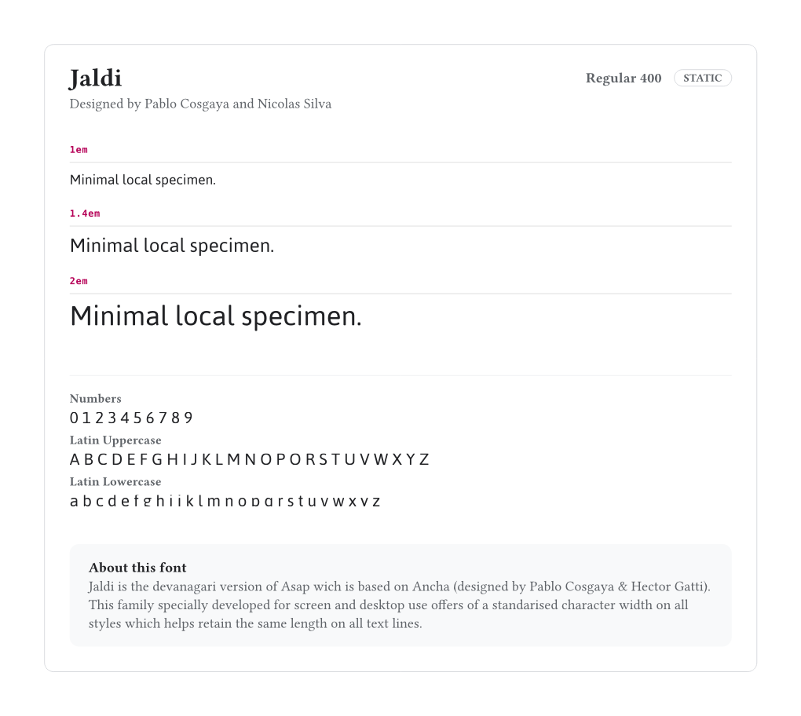
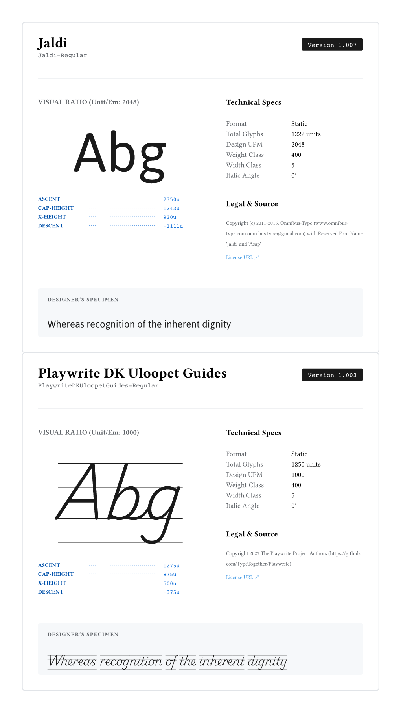
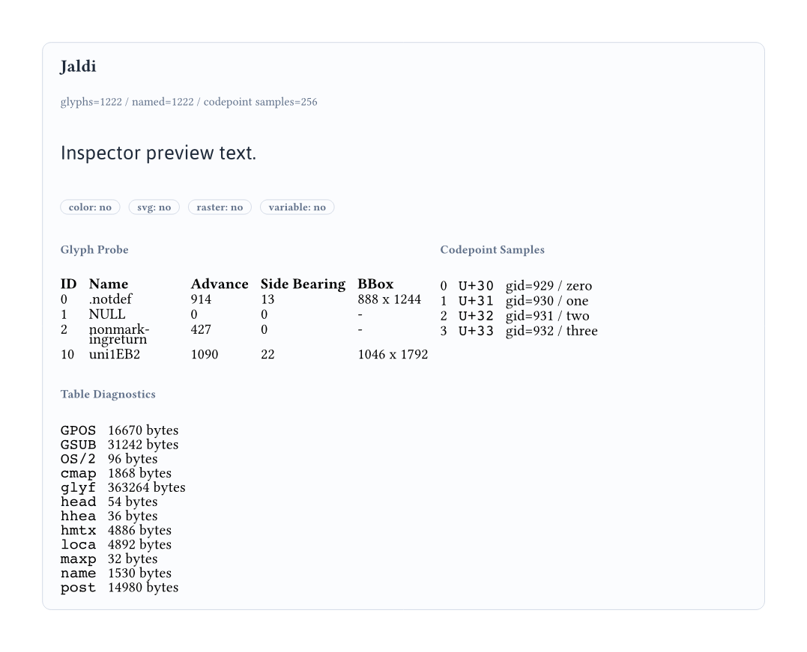
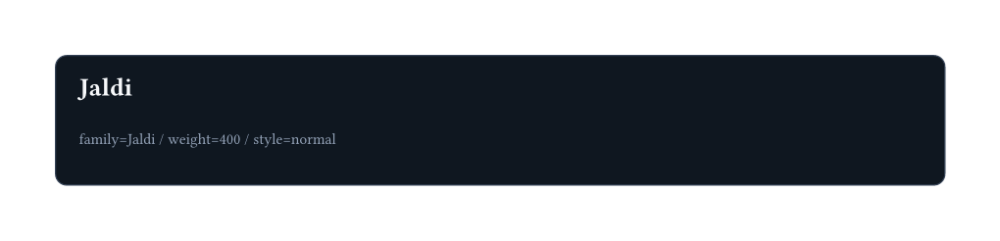
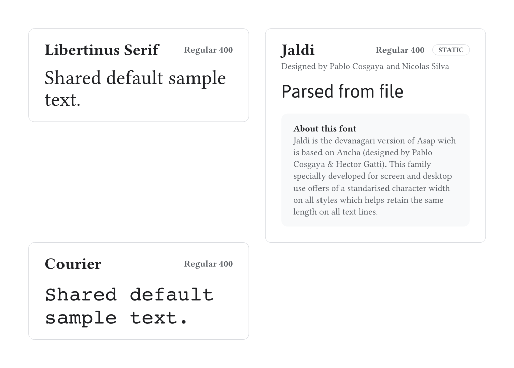
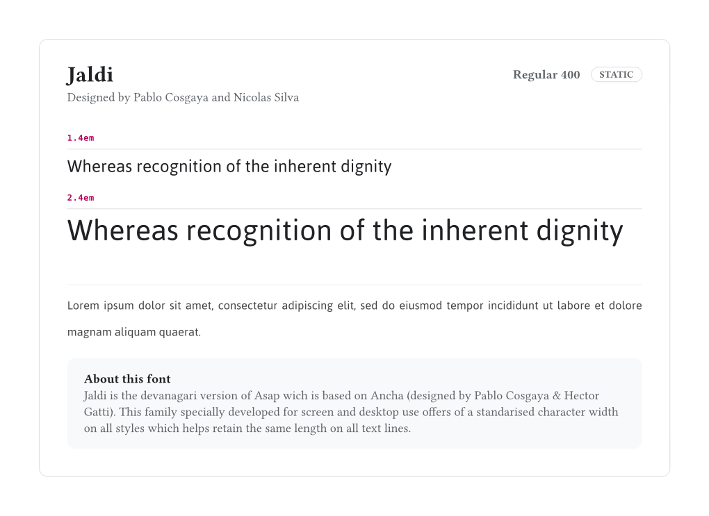
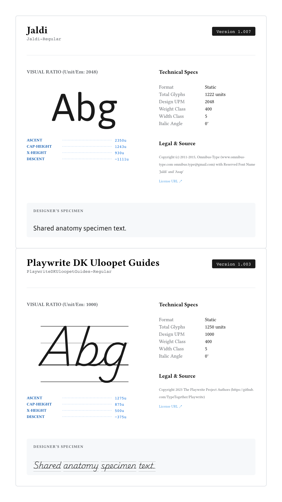

# typarium

**typarium** is a Typst package for building expressive font specimen cards from system fonts, local font files, and mixed metadata dictionaries.

## Usage

### Basic Local Font Specimen

To render a local font file with the default renderer, place the font next to your document and pass it as raw bytes:

```typst
#import "@local/typarium:0.1.0": font-showcase

#font-showcase(
  theme: (
    sample-text: "Minimal local specimen.",
    show-glyphs: true,
    waterfall: (1.0em, 1.4em, 2.0em),
  ),
  fonts: ((path: read("Jaldi-Regular.ttf", encoding: none)),),
)
```



### Anatomy Renderer

To inspect metrics and technical metadata with the bundled anatomy renderer:

```typst
#import "@local/typarium:0.1.0": font-showcase, anatomy-theme, anatomy-render

#font-showcase(
  fonts: (
    (path: read("Jaldi-Regular.ttf", encoding: none)),
    (
      path: read("PlaywriteDKUloopetGuides-Regular.ttf", encoding: none),
      theme: (visual-sample-inset-bottom: 5em),
    ),
  ),
  theme: anatomy-theme + (
    sample-text: "An anatomy-oriented specimen card.",
  ),
  render: anatomy-render,
)
```



### Inspector Renderer

To inspect parsed glyph metrics, codepoint samples, and table diagnostics with the bundled inspector renderer:

```typst
#import "@local/typarium:0.1.0": font-showcase, inspector-theme, inspector-render

#font-showcase(
  theme: inspector-theme,
  render: inspector-render,
  fonts: ((path: read("Jaldi-Regular.ttf", encoding: none)),),
)
```



See also [variation-request.typ](package/examples/variation-request.typ) for a standalone custom renderer that reads `variation-request` and `variation-support` directly.

### Custom Theme and Renderer

The recommended pattern is `item -> theme -> metadata -> fallback`.

```typst
#import "@local/typarium:0.1.0": font-showcase

#let poster-theme = (
  color-bg: rgb("0f1720"),
  color-primary: rgb("f8fafc"),
  color-muted: rgb("94a3b8"),
  stroke-card: 0.6pt + rgb("334155"),
  card-inset: 1.2em,
  size-title: 1.3em,
  size-meta: 0.78em,
  size-sample: 2.1em,
  gap-meta: 0.4em,
  gap-sample: 0.9em,
  sample-text: "Theme drives shared renderer options.",
)

#let poster-render = it => {
  let ft = it.font-text
  let opt = (key, default) => {
    let overrides = it.at("item-overrides", default: (:))
    if type(overrides) == dictionary and key in overrides {
      overrides.at(key)
    } else {
      it.theme.at(key, default: it.at(key, default: default))
    }
  }

  block(
    breakable: false,
    width: 100%,
    fill: opt("color-bg", black),
    stroke: opt("stroke-card", none),
    inset: opt("card-inset", 1em),
    radius: 0.6em,
    [
      #text(size: opt("size-title", 1.2em), weight: "bold", fill: opt("color-primary", white))[#it.name]
      #v(opt("gap-meta", 0.4em))
      #text(size: opt("size-meta", 0.8em), fill: opt("color-muted", white))[
        family=#it.render-name / weight=#it.weight / style=#it.style
      ]
      #v(opt("gap-sample", 0.8em))
      #ft(size: opt("size-sample", 2em), fill: opt("color-primary", white))[
        #opt("sample-text", "Fallback specimen")
      ]
    ],
  )
}

#font-showcase(
  theme: poster-theme,
  render: poster-render,
  fonts: ((path: read("Jaldi-Regular.ttf", encoding: none)),),
)
```



Per-font dictionaries can still override any renderer-facing keys, including `sample-text` and per-card `theme`.

### Mixed Input Array

You can combine system fonts, local files, and manual dictionaries in one call:

```typst
#import "@local/typarium:0.1.0": font-showcase

#font-showcase(
  columns: 2,
  theme: (
    sample-text: "Shared default sample text.",
  ),
  fonts: (
    "Libertinus Serif",
    (path: read("Jaldi-Regular.ttf", encoding: none), sample-text: "Parsed from file"),
    (name: "Courier", display-name: "Courier (Manual Label)"),
  ),
)
```



### Top-Level Theme Override

To restyle all cards in one showcase:

```typst
#import "@local/typarium:0.1.0": font-showcase, default-theme

#font-showcase(
  theme: default-theme + (
    paragraph-text: lorem(20),
    waterfall: (1.4em, 2.4em),
    card-inset: 2em,
    color-primary: rgb("202124"),
  ),
  fonts: ((path: read("Jaldi-Regular.ttf", encoding: none)),),
)
```



### Per-Font Theme Override

To restyle only one card inside a multi-font showcase:

```typst
#import "@local/typarium:0.1.0": font-showcase, anatomy-theme, anatomy-render

#font-showcase(
  theme: anatomy-theme + (
    sample-text: "Shared anatomy specimen text.",
  ),
  render: anatomy-render,
  fonts: (
    (path: read("Jaldi-Regular.ttf", encoding: none)),
    (
      path: read("PlaywriteDKUloopetGuides-Regular.ttf", encoding: none),
      theme: (visual-sample-inset-bottom: 5em),
    ),
  ),
)
```



## API Reference

### `font-showcase`

Renders one or more font specimen cards.

```typst
#font-showcase(
  fonts: auto,
  theme: (:),
  render: auto,
  columns: 1,
)
```

**Key Parameters:**

- `fonts` (`auto | str | bytes | dictionary | array`): Font sources to render. Use raw bytes for user-local font files.
- `theme` (`dictionary`): Showcase-level renderer configuration and design-token payload passed into the active renderer layer.
- `render` (`function | auto`): Custom card renderer. If `auto`, uses `default-render`.
- `columns` (`int`): Number of cards per grid row.
- Renderer-facing keys such as `sample-text`, `sample-size`, `waterfall`, `show-glyphs`, `show-details`, `leading`, `features`, `lang`, `script`, `title-overflow`, and `title-overflow-badge-position` are supplied through `theme` or per-font dictionaries.

### `set-variations`

Normalizes a variable-axis request onto a font item or theme dictionary.

```typst
#set-variations(target, values)
```

- If `target` is a font-item dictionary, the helper returns that dictionary with `variation-values` inserted.
- If `target` is a font-name string, it returns a dictionary using `name:`. If `target` is raw bytes, it returns a dictionary using `path:`.
- `font-showcase` converts `variation-values` into `variation-request`, which renderers can inspect today even though Typst 0.14.x does not yet apply variable axes in shaping.
- The warning about variable fonts comes from Typst itself, not from typarium. Installing a static instance of the same family can remove the warning, but it does not enable true variable-axis shaping in Typst.

### `default-theme`, `terminal-theme`, `anatomy-theme`, `inspector-theme`

Bundled theme dictionaries used by the packaged renderers.

- `default-theme` exposes a broad design-token surface for editorial specimen cards.
- `terminal-theme` provides a compact terminal-style override.
- `anatomy-theme` exposes technical layout tokens for metric-heavy anatomy cards.
- `inspector-theme` exposes inspection-focused tokens such as `probe-glyph-ids` and `sample-codepoint-count`.
### `default-render`, `terminal-render`, `anatomy-render`, `inspector-render`

Bundled renderer functions you can pass to `render`.

- `default-render`: editorial specimen layout with badges, waterfall support, descriptions, glyphs, and metadata rows.
- `terminal-render`: command-line styled specimen card.
- `anatomy-render`: metric and metadata focused layout for technical inspection.
- `inspector-render`: glyph probe, codepoint sample, variation request, and table diagnostic inspector.

## Input Shapes

`fonts` supports four common forms:

- `auto`: uses the current Typst font context.
- `"Libertinus Serif"`: renders a system font by family name.
- `read("Jaldi-Regular.ttf", encoding: none)`: parses and renders raw font bytes directly.
- `(path: read("Jaldi-Regular.ttf", encoding: none), name: "Custom Label")`: parses a file and applies explicit overrides.

## Under the Hood

The processing workflow is:

1. `font-showcase` normalizes the input shape and resolves the showcase-level theme.
2. Raw font bytes are passed to `font_parser.wasm`.
3. The Rust parser extracts names, permissions, collection summaries, metrics, variation axes, table diagnostics, codepoint samples, glyph-name indices, and per-glyph metric/image records.
4. Metadata keys are normalized into Typst-friendly hyphenated names.
5. A prepared `font-text` helper is created from the resolved font family and shaping options.
6. Variable-axis requests are normalized into `variation-request` metadata for renderers.
7. The bundled or custom renderer receives the final render payload as `it`.

In practice, if you are designing your own renderer, `theme` and per-font dictionaries are the preferred place for specimen-specific settings.

## Custom Renderer Tips

- Put shared renderer options in `theme`.
- Put card-specific exceptions in the font item dictionary.
- Resolve options in the order `item -> theme -> metadata -> literal fallback`.
- Use `set-variations(...)` when you want a host-level variable request contract that custom renderers can read consistently.
- Always render specimen text with `it.font-text` so resolved `features`, `lang`, `script`, and fallback behavior stay intact.
- Set `breakable: false` on the outermost card block when a whole card should stay on one page.

## Notes

### Local Font Files

Installed Typst packages cannot directly read arbitrary files from the user project through package-relative paths, so local fonts should normally be passed as raw bytes via `read("FontFile.ttf", encoding: none)` into the `path` field.

### Family-Name Fonts

If you specify a font only by family name, such as `(name: "Jaldi")`, typarium can render it through Typst's text engine but cannot inspect the underlying font file. In that mode, parsed metadata such as `glyphs`, `glyph-details`, `number-of-glyphs`, name-table records, permissions, and variation axes are not available unless you provide them manually.

### Design Model

`default`, `terminal`, `anatomy`, and `inspector` are sample implementations. The real core of the package is the more primitive `font-showcase` host, which resolves font metadata, prepares `font-text`, merges showcase-level and per-font theme overrides, and lets users define their own renderer behavior through `render`.

## License

This project is distributed under the MIT License. See [LICENSE](LICENSE) for details.
